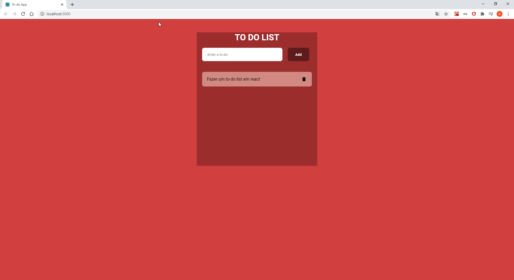

# TO DO APP

Aplicativo de to-do list feito react



## Usage

Instalar dependências utilizadas no projeto, basta seguir abaixo.

``` node
npm install
npm start
```

## Considerações finais

Durante a criação do projeto, foi utilizado o react hook useState() para armazenamento
de inputs setados e para criação dinâmica de divs com as to-do digitadas.